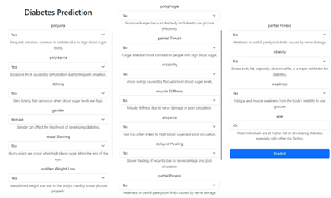
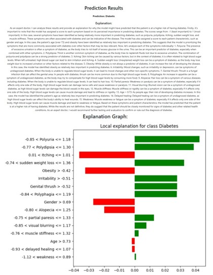

# 🧠 Early Diabetes Prediction Using Machine Learning and Explainable AI

This full-stack project provides an end-to-end solution for predicting early-stage diabetes using a deep learning model integrated with explainable AI (XAI). It features a machine learning backend built with FastAPI, a React-based frontend, and visual explanations powered by SHAP and LIME.

---

## 🎯 Project Objectives

- Predict early-stage diabetes using structured medical data and symptom-based questionnaires.
- Improve model generalization through transfer learning across multiple datasets.
- Enhance clinical interpretability with SHAP, LIME, and natural language explanations.
- Provide an interactive user interface for real-time predictions.

---

## 📁 Project Structure

```
├── backend/        # FastAPI backend
│   ├── main.py     # API endpoints
│   ├── model/      # Saved model (.keras or .pt)
│   └── utils/      # Preprocessing and XAI logic
├── frontend/       # React frontend
│   ├── src/
│   ├── public/
│   └── package.json
├── notebooks/
│   ├── MultiheadAttentionFCN.ipynb  # Deep learning training
│   └── XAI.ipynb                    # SHAP & LIME explanations
├── images/         # UI screenshots
│   ├── frontend_before.png
│   └── frontend_after.png
├── README.md
└── requirements.txt
```
---

## 🧰 Technologies Used

### Backend
- **FastAPI** – API server for predictions
- **TensorFlow/Keras** – Deep learning framework
- **SHAP, LIME** – Explainability libraries
- **Uvicorn** – ASGI server

### Frontend
- **React** – User interface
- **Axios** – API communication
- **Chart.js / D3.js** (optional) – Visuals for SHAP/LIME

### ML Core
- **Python, NumPy, Pandas**
- **SMOTE** for class balancing
- **Multi-Head Attention Fully Convolutional Network (MHA-FCN)**
- **LLMs** for natural language explanation generation

---

## 📊 Datasets

1. **Kaggle Clinical Dataset** – Structured features (e.g., glucose, BMI)
2. **BRFSS Dataset** – Behavioral indicators
3. **Symptom Questionnaire Dataset** – Patient-reported symptoms

---

## 🧠 Model Architecture

- Dense layers with Dropout and Batch Normalization
- Multi-Head Attention (7 heads, key dimension = 32)
- Sigmoid output layer for binary classification
- Transfer learning strategy applied across datasets

---


## 🚀 Running the Project

### Backend (FastAPI)

```bash
cd FastAPI
pip install -r ../requirements.txt
uvicorn main:app --reload
```

```bash
cd frontend
npm install
npm start
```

## 📈 Model Performance
| Model Variant               | Test Accuracy | Notes                          |
|----------------------------|---------------|--------------------------------|
| Transfer_Learning          | 91%           | Trained on clinical dataset    |
| Transfer_Learning_Exp_Brfss| 87%           | Trained on BRFSS behavioral data |
| Transfer_Learning_Symptom  | 98%           | Trained on symptom-based input |

- High interpretability with SHAP and LIME
- LLM-based explanation provides readable insights for clinicians


## 🧪 Explainability (XAI)
- SHAP: Feature-level attribution for predictions
- LIME: Local surrogate model for specific predictions
- LLMs: Converts outputs to human-readable explanations

## 📸 Screenshots
### 🖼️ Before Prediction (Form Input UI)


### ✅ After Prediction (Results & Explanation)


[Traning and testing reports](https://api.wandb.ai/links/prayagpiya12-lakehead-university/qb2yeika)
